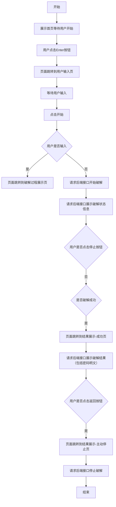

# Phase 3: Web UI 实现 - 技术设计文档

> **阶段**: Phase 3 - 前端 Web UI 开发
> **分支**: `260521-feat-web-ui`
> **创建日期**: 2026-05-21
> **状态**: **设计中**

---

## 1. 阶段概述

Phase 3 聚焦于前端 Web UI 的完整实现，为用户提供图形化操作界面，替代原有的 CLI 终端交互。前端将直接挂载于 FastAPI 静态文件服务，实现单端口部署。

### 目标

- 提供直观的密码输入、任务控制与实时进度展示界面
- 通过 WebSocket 接收实时进度推送，实现无刷新状态更新
- 通过 REST API 控制破解任务的启动、停止与结果查询
- 保持与 Phase 1/2 相同的功能完整性

---

## 2. 技术栈

### 前端技术栈

| 组件 | 选择 | 版本要求 | 说明 |
|------|------|---------|------|
| **框架** | 纯 HTML + JavaScript (Vanilla) | ES6+ | 演示程序无需复杂框架，减少构建步骤和依赖 |
| **样式** | Tailwind CSS (CDN) | v3.x | 快速原型开发，无需本地编译，响应式设计开箱即用 |
| **实时通信** | 原生 WebSocket API | 浏览器内置 | 与后端 `/ws/crack/progress` 直连 |
| **HTTP 请求** | Fetch API | 浏览器内置 | 轻量简洁，处理 4 个 REST 端点 |
| **图标** | 内联 SVG 或 Unicode 符号 | - | 避免额外图标库依赖，保持极简 |
| **部署方式** | FastAPI `StaticFiles` 挂载 | - | 后端直接服务前端文件，无需额外服务器 |

### 后端技术栈（Phase 2 已确定）

| 组件 | 选择 | 版本要求 | 说明 |
|------|------|---------|------|
| Web 框架 | FastAPI | >= 0.100.0 | 异步支持、自动文档、类型安全 |
| ASGI 服务器 | uvicorn | >= 0.23.0 | 高性能、支持 WebSocket |
| 数据验证 | Pydantic | v2 | 与 FastAPI 原生集成 |
| WebSocket | websockets | FastAPI 内置 | 实时双向通信 |
| CORS | fastapi.middleware.cors | 内置 | 跨域资源共享 |

---

## 3. 架构设计

### 3.1 整体架构

```
用户浏览器
  ├── Fetch API ──→ POST/GET /api/v1/crack/* (REST)
  └── WebSocket ──→ /ws/crack/progress (实时推送)
         ↓
FastAPI (uvicorn:8000)
  ├── 静态文件挂载 (brute_force/static/index.html)
  ├── REST API 路由
  └── WebSocket 路由
```

### 3.2 文件结构

```
brute_force/
├── server.py              # FastAPI 应用入口（Phase 2 已有）
├── schemas.py             # Pydantic 模型（Phase 2 已有）
├── callback.py            # WebCallback 实现（Phase 2 已有）
├── ws_manager.py          # WebSocket 连接管理（Phase 2 已有）
├── utils.py               # 工具函数（Phase 2 已有）
└── static/                # 新增：前端静态文件目录
    ├── index.html         # 主页面
    └── app.js             # 前端业务逻辑（可选拆分）
```

### 3.3 方案优势

1. **零构建流程**：无需 `npm install`、Webpack、Vite 等工具链，编辑 HTML 即可生效
2. **单文件交付**：所有前端代码集中在 `index.html` 中，简化部署和维护
3. **完全兼容**：支持 Win 7/10/11 的主流浏览器（Chrome、Edge、Firefox）
4. **与后端无缝集成**：FastAPI 原生支持静态文件服务，同源部署无 CORS 问题

---

## 4. 页面设计

### 4.1 视觉风格

整体采用**网络安全/科技感**设计风格：

- **背景**：深蓝色宇宙背景，带有数字流（0/1代码雨）、粒子光点、地球弧面光晕
- **主色调**：深蓝 (#0a192f)、亮蓝 (#00d4ff)、白色 (#ffffff)
- **强调色**：黄色 (#ffd700) 用于按钮文字，红色 (#ff4444) 用于警示语
- **字体**：白色粗体标题，带阴影增强对比度

### 4.2 页面列表

根据设计图，前端包含以下页面/状态：

| 页面 | 说明 | 主要元素 | 背景素材 |
|------|------|---------|---------|
| **首页** | 启动/欢迎页面 | 标题、红色警示语、Enter 按钮、署名信息 | `index-background.png` |
| **用户输入页** | 密码输入界面 | 标题、"请输入密码："提示、密码输入框、"开始"按钮、红色警示语 | `index-background.png` |
| **破解进行页** | 实时进度展示 | 累计尝试次数、计时器、播放/暂停/停止按钮 | 数字雨动画 (Canvas) |
| **结果页-成功** | 破解成功展示 | 密码明文、皇冠图标、"返回"按钮 | 数字雨动画 (Canvas) |
| **结果页-停止** | 主动终止展示 | 终止时统计信息、"返回"按钮 | 数字雨动画 (Canvas) |

### 4.3 图片素材说明

| 文件名 | 用途 | 位置 |
|--------|------|------|
| `index-background.png` | 首页和用户输入页的背景图片 | `brute_force/static/assets/` |
| `Enter-button.png` | 首页 Enter 按钮的背景图片 | `brute_force/static/assets/` |
| `crown.png` | 破解成功时展示的皇冠图标 | `brute_force/static/assets/` |

### 4.3 页面布局详细设计

#### 首页布局

```
+--------------------------------------------------+
| [左上] 仅教学演示使用请勿用于其它用途 (红色)       |
|                                                  |
|                                                  |
|              弱口令暴力破解演示（体验）             |
|                  (白色大字，带阴影)                 |
|                                                  |
|                  [    Enter    ]                   |
|              (Enter-button.png 背景)               |
|                                                  |
|                              胡震阳                |
|                          丹阳市新桥初级中学         |
+--------------------------------------------------+
```

**背景**：`index-background.png` 全屏覆盖，深蓝宇宙科技风格

#### 用户输入页布局

```
+--------------------------------------------------+
| 弱口令暴力破解演示（体验）                          |
|                                                  |
|  请输入密码：                                      |
|  [____________________________][  开始  ]          |
|  (白色输入框)                   (灰白渐变按钮)      |
|                                                  |
|                                                  |
|                              [地球弧面背景]        |
|                    仅数字演示使用请勿用作其它用途   |
+--------------------------------------------------+
```

**背景**：`index-background.png` 全屏覆盖，与首页共用同一背景

#### 破解过程展示页布局

```
+--------------------------------------------------+
| 弱口令暴力破解演示（体验）                          |
|                                                  |
|              累计尝试 912345 次                     |
|                                                  |
|                00 : 01 : 09.231                   |
|                (超大号白色数字)                     |
|                                                  |
|                                                  |
|                        [▶] [⏸] [⏹]                |
|                        (黄圆白图标)                 |
|                    仅教学演示使用请勿用作其它用途   |
+--------------------------------------------------+
```

**背景**：纯黑底色 + 绿色数字雨动态背景 (Matrix 风格)

**元素说明**：
- **累计尝试次数**：白色文字，居中偏上
- **计时器**：超大号白色数字，格式 `HH:MM:SS.mmm`，视觉焦点
- **控制按钮组**：三个黄色圆形按钮，白色图标
  - ▶ 播放/继续 (三角形)
  - ⏸ 暂停 (双竖线)
  - ⏹ 停止 (方形)
- **免责声明**：红色文字，右下角

#### 破解成功展示页布局

```
+--------------------------------------------------+
| 弱口令暴力破解演示（体验）                          |
|                                                  |
|              累计尝试 912345 次                     |
|                                                  |
|                00 : 01 : 09.231                   |
|                (超大号白色数字)                     |
|                                                  |
|                    [crown.png]                    |
|                                                  |
|              密码：123456789                        |
|                                                  |
|                        [→]                        |
|                      (绿圆白箭头)                   |
|                    仅教学演示使用请勿用于其它用途   |
+--------------------------------------------------+
```

**背景**：纯黑底色 + 绿色数字雨动态背景 (Canvas 动画)

**元素说明**：
- **累计尝试次数**：白色文字，居中偏上
- **计时器**：超大号白色数字，显示破解用时
- **皇冠图标**：金橙色皇冠带红色点缀，表示成功
- **密码明文**：白色文字，显示破解结果
- **继续按钮**：绿色圆形按钮，白色右箭头，用于返回
- **免责声明**：红色文字，右下角

#### 用户主动停止展示页布局

```
+--------------------------------------------------+
| 弱口令暴力破解演示（体验）                          |
|                                                  |
|              累计尝试 12345 次                      |
|                                                  |
|                00 : 01 : 09.231                   |
|                (超大号白色数字)                     |
|                                                  |
|            用户主动停止......                       |
|                                                  |
|                        [→]                        |
|                      (绿圆白箭头)                   |
|                    仅教学演示使用请勿用于其它用途   |
+--------------------------------------------------+
```

**背景**：纯黑底色 + 绿色数字雨动态背景 (Matrix 风格)

**元素说明**：
- **累计尝试次数**：白色文字，显示终止时的尝试次数
- **计时器**：超大号白色数字，显示终止时的用时
- **状态提示**：白色文字"用户主动停止......"
- **继续按钮**：绿色圆形按钮，白色右箭头，用于返回
- **免责声明**：红色文字，右下角

### 4.4 数字雨动态背景实现

破解过程展示页、成功页、停止页均采用**绿色数字雨动态背景**，实现方式：

```javascript
// Canvas 实现 Matrix 风格数字雨
const canvas = document.getElementById('matrix-bg');
const ctx = canvas.getContext('2d');

// 字符集：数字、字母混合
const chars = '0123456789ABCDEFGHIJKLMNOPQRSTUVWXYZabcdefghijklmnopqrstuvwxyz';

// 每列的位置和下落速度
const columns = Math.floor(canvas.width / fontSize);
const drops = Array(columns).fill(1);

function drawMatrix() {
  // 半透明黑色覆盖，形成拖尾效果
  ctx.fillStyle = 'rgba(0, 0, 0, 0.05)';
  ctx.fillRect(0, 0, canvas.width, canvas.height);
  
  // 绿色字符
  ctx.fillStyle = '#0F0';
  ctx.font = fontSize + 'px monospace';
  
  for (let i = 0; i < drops.length; i++) {
    const text = chars[Math.floor(Math.random() * chars.length)];
    ctx.fillText(text, i * fontSize, drops[i] * fontSize);
    
    // 随机重置到顶部
    if (drops[i] * fontSize > canvas.height && Math.random() > 0.975) {
      drops[i] = 0;
    }
    drops[i]++;
  }
}

setInterval(drawMatrix, 33); // ~30fps
```

**样式参数**：
- 背景色：纯黑 `#000000`
- 字符色：荧光绿 `#00FF00` 或 `#0F0`
- 字体：等宽字体 `monospace`
- 字号：14px
- 刷新率：~30fps

### 4.5 响应式设计

- **桌面端**：完整布局，所有元素居中显示
- **平板端**：自适应宽度，保持所有信息可见
- **移动端**：单列布局，按钮适当放大便于触摸操作

---

## 5. 交互流程

### 5.1 页面流转图

根据设计图提供的流程图，完整的用户交互流程如下：



> 注：流程图中"返回按钮"实际指向重新开始流程，回到首页或用户输入页。

### 5.2 SPA 单页应用架构

前端采用**单页应用 (SPA)** 架构，所有视图共用同一个 HTML 页面，通过 JavaScript 控制不同 `<div>` 区域的显示/隐藏来实现页面切换：

```html
<!-- 视图容器 -->
<div id="view-home" class="view">        <!-- 首页 -->
<div id="view-input" class="view hidden"> <!-- 用户输入页 -->
<div id="view-cracking" class="view hidden"> <!-- 破解过程展示页 -->
<div id="view-success" class="view hidden">  <!-- 破解成功展示页 -->
<div id="view-stopped" class="view hidden">  <!-- 用户主动停止展示页 -->
```

**视图切换逻辑**：
- 添加 `hidden` 类：`element.classList.add('hidden')` → 隐藏
- 移除 `hidden` 类：`element.classList.remove('hidden')` → 显示

### 5.3 页面加载

1. 用户访问 `http://127.0.0.1:8000/`
2. 浏览器加载 `index.html` 和 Tailwind CSS CDN
3. 自动建立 WebSocket 连接到 `/ws/crack/progress`
4. 显示首页 (`#view-home`)，其他视图隐藏

### 5.4 启动破解

1. 用户在首页点击 Enter 按钮 → 切换到用户输入页 (`#view-input`)
2. 用户输入目标密码
3. 前端进行本地校验（仅允许字母和数字）
4. 点击"开始"按钮
5. 发送 `POST /api/v1/crack/start` 请求
6. 收到成功响应后，切换到破解过程展示页 (`#view-cracking`)
7. 开始接收 WebSocket 进度推送

### 5.5 实时进度更新

1. WebSocket 接收 `progress` 类型消息
2. 更新累计尝试次数和计时器显示
3. 收到 `found` 类型消息时：
   - 切换到成功展示页 (`#view-success`)
   - 显示密码明文和皇冠图标
   - 请求 `GET /api/v1/crack/result` 获取完整结果
4. 收到 `terminated` 类型消息时：
   - 切换到停止展示页 (`#view-stopped`)
   - 显示终止时的统计信息

### 5.6 停止破解

1. 用户点击停止按钮 (⏹)
2. 发送 `POST /api/v1/crack/stop` 请求
3. 收到响应后，切换到停止展示页 (`#view-stopped`)
4. 显示终止时的统计信息

### 5.7 返回/重新开始

1. 用户点击返回按钮 (→)
2. 切换到首页 (`#view-home`) 或用户输入页 (`#view-input`)
3. 重置所有状态，等待下一次操作

---

## 6. 与后端 API 对接

### 6.1 REST API 调用

| 操作 | 方法 | 端点 | 请求体 | 响应处理 |
|------|------|------|--------|---------|
| 启动任务 | POST | `/api/v1/crack/start` | `{"password": "...", "worker_count": 0}` | 显示成功状态，更新 UI |
| 查询状态 | GET | `/api/v1/crack/status` | - | 页面加载时获取初始状态 |
| 停止任务 | POST | `/api/v1/crack/stop` | - | 显示终止状态 |
| 查询结果 | GET | `/api/v1/crack/result` | - | 显示破解结果 |

### 6.2 WebSocket 消息处理

| 消息类型 | 触发时机 | 前端行为 |
|---------|---------|---------|
| `progress` | 引擎定期推送 | 更新状态面板和 Worker 进度条 |
| `found` | 找到密码 | 显示结果区域，停止计时 |
| `terminated` | 任务被终止 | 显示终止状态，更新统计 |
| `error` | 发生错误 | 显示错误提示，恢复空闲状态 |
| `ping` | 心跳保活 | 忽略（由 WebSocket 底层处理） |

---

## 7. 开发任务编排

### Node 1: 基础设施搭建

| 子任务 ID | 任务名称 | 产出文件 | 说明 |
|-----------|---------|----------|------|
| N1-1 | 静态目录创建 | `brute_force/static/` | 创建前端文件目录和 assets 子目录 |
| N1-2 | 资源文件复制 | `brute_force/static/assets/` | 复制图片素材到 assets 目录 |
| N1-3 | FastAPI 静态挂载 | `brute_force/server.py` | 添加 `StaticFiles` 配置，挂载 `/` 到 `index.html` |
| N1-4 | HTML 骨架创建 | `brute_force/static/index.html` | 页面结构、Tailwind CDN 引入、5 个视图容器 |

**验收标准**：
- 访问 `http://127.0.0.1:8000/` 显示基础页面
- Tailwind CSS 样式正常加载
- 图片资源可正常访问
- 5 个视图容器结构正确

### Node 2: 页面视图与交互

| 子任务 ID | 任务名称 | 产出文件 | 说明 |
|-----------|---------|----------|------|
| N2-1 | 首页视图实现 | `brute_force/static/index.html` | 标题、Enter 按钮、免责声明、署名信息 |
| N2-2 | 输入页视图实现 | `brute_force/static/index.html` | 标题、密码输入框、"开始"按钮、免责声明 |
| N2-3 | SPA 视图切换 | `brute_force/static/index.html` (script) | 视图显示/隐藏逻辑、Enter/开始按钮事件 |
| N2-4 | 密码本地校验 | `brute_force/static/index.html` (script) | 白名单校验（仅字母数字）、错误提示 |

**验收标准**：
- 首页 Enter 按钮可切换到输入页
- 输入页可输入密码并点击开始
- 非法输入被正确拦截并提示
- 视图切换流畅无闪烁

### Node 3: 破解过程展示

| 子任务 ID | 任务名称 | 产出文件 | 说明 |
|-----------|---------|----------|------|
| N3-1 | 破解过程页视图 | `brute_force/static/index.html` | 标题、累计尝试次数、计时器、控制按钮 |
| N3-2 | Canvas 数字雨背景 | `brute_force/static/index.html` (script) | Matrix 风格绿色代码雨动画 |
| N3-3 | 计时器组件 | `brute_force/static/index.html` (script) | HH:MM:SS.mmm 格式，实时更新 |
| N3-4 | 控制按钮组 | `brute_force/static/index.html` | 播放/暂停/停止三个圆形按钮 |
| N3-5 | 成功展示页视图 | `brute_force/static/index.html` | 皇冠图标、密码明文、返回按钮 |
| N3-6 | 停止展示页视图 | `brute_force/static/index.html` | 停止状态提示、返回按钮 |

**验收标准**：
- Canvas 数字雨动画流畅运行 (~30fps)
- 计时器格式正确，实时更新
- 三个控制按钮样式正确
- 成功页显示皇冠和密码
- 停止页显示状态提示

### Node 4: 后端通信联调

| 子任务 ID | 任务名称 | 产出文件 | 说明 |
|-----------|---------|----------|------|
| N4-1 | WebSocket 连接 | `brute_force/static/index.html` (script) | 建立连接、消息处理、状态机 |
| N4-2 | REST API 封装 | `brute_force/static/index.html` (script) | start/stop/status/result 调用封装 |
| N4-3 | 进度推送联调 | `brute_force/static/index.html` (script) | WebSocket 消息驱动 UI 更新 |
| N4-4 | 断线重连逻辑 | `brute_force/static/index.html` (script) | 自动重连、状态恢复 |

**验收标准**：
- 页面加载自动建立 WebSocket 连接
- 启动破解后收到进度推送并更新 UI
- 停止破解后收到终止消息并切换视图
- 断线后自动重连，恢复状态

### Node 5: 测试与优化

| 子任务 ID | 任务名称 | 产出文件 | 说明 |
|-----------|---------|----------|------|
| N5-1 | 响应式适配 | - | 桌面/平板/手机多尺寸测试 |
| N5-2 | 浏览器兼容性 | - | Chrome/Edge/Firefox 测试 |
| N5-3 | 性能优化 | - | Canvas 动画优化、DOM 更新节流 |

**验收标准**：
- 各尺寸下页面布局正常
- 主流浏览器功能正常
- 动画流畅，无明显卡顿

---

## 8. 开发顺序建议

1. **Node 1 先行**：完成静态文件目录和基础页面结构，确保 FastAPI 能正确服务前端文件
2. **Node 2 跟进**：实现 REST API 调用和 WebSocket 连接，验证前后端通信
3. **Node 3 收尾**：完善实时状态展示和结果面板，优化用户体验

每个节点完成后应进行独立验证，确保功能正常后再进入下一节点。

---

## 9. 注意事项

- **WebSocket 重连**：前端需处理 WebSocket 断线重连，避免页面刷新后丢失连接
- **状态同步**：页面加载时应先查询 `/api/v1/crack/status` 获取当前任务状态
- **错误处理**：所有 API 调用需包含完整的错误处理，向用户展示友好提示
- **浏览器兼容**：确保在 Chrome、Edge、Firefox 等主流浏览器中正常工作
- **性能优化**：WebSocket 消息频率较高时，考虑节流更新 DOM，避免频繁重绘
